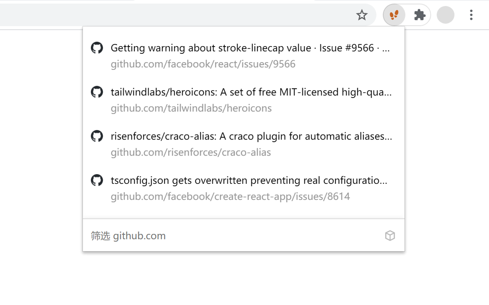

<p align="center">
  
</p>
<p align="center">
  <a href="https://chrome.google.com/webstore/detail/aifnngnkjcdamfofbfldbnighkjkkmbp"></a>
  <a href="https://chrome.google.com/webstore/detail/aifnngnkjcdamfofbfldbnighkjkkmbp"></a>
  <a href="https://github.com/fiteprint/fiteprint/actions"></a>
  <a href="https://github.com/fiteprint/fiteprint/graphs/contributors"></a>
</p>

## Introduction

Fiteprint is a Chrome browser extension that helps you quickly access context-based history. When you are browsing a website, just click on the icon of this extension to view the history of the current site (don't forget to pin it to the top right corner of browser), if it's a blank new tab, it will show the history of all sites.

The extension makes some optimizations to the original history list, to reduce redundancy and increase the amount of information, it removes duplicate items and shows url paths (based on what users care about most of the time).

You can filter items by simply typing in keywords. 

If you prefer to use shortcuts, just open `chrome://extensions/shortcuts` and set a shortcut for this extension (e.g. `Ctrl` + `Shift` + `8`) to summon the history list via shortcut keys, then use the following keystrokes:

- Select previous: `ArrowUp`
- Select next: `ArrowDown`
- Quickly jump upwards: `Shift` + `ArrowUp`
- Quickly jump down: `Shift` + `ArrowDown`
- Open: `Enter`
- Force open in a new tab: `Shift` + `Enter`

Hope you enjoy it!

## Screenshot

<p align="center">
  
</p>

## Development

This project uses a very common technology stack: [webpack](https://webpack.js.org/) + [TypeScript](https://www.typescriptlang.org/) + [React](https://reactjs.org/). If you're a front-end engineer, you probably already know how to get started:

```bash
yarn dev

yarn build

yarn test

yarn lint
```
New PR is always welcomed!
